|  | Pemrograman Berbasis Objek |
|--|--|
| NIM |  254107020062|
| Nama | Aura Bintang Aprilian |
| Kelas | TI - 2G |
| Repository | [link] (https://github.com/bebeaura1/PBO/tree/main/Jobsheet1) |

# Pengantar Konsep Pemrograman Berorientasi Objek

## 3.1. Percobaan 1
Untuk hasil running program pada percobaan 1 yaitu seperti pada gambar di bawah ini 
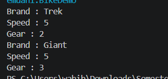

## 3.2. Percobaan 2
Untuk hasil running program pada percobaan 2 yaitu seperti pada gambar di bawah ini 
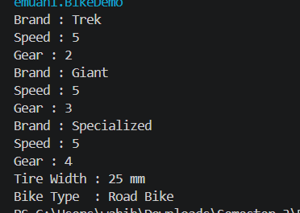

## 5. Pertanyaan
1. Jelaskan perbedaan antara object dengan class!
2. Jelaskan alasan gear dan brand dapat menjadi atribut dari object Bike!
3. Sebutkan salah satu kelebihan utama dari pemrograman berorientasi objek dibandingkan
dengan pemrograman prosedural!
4. Apakah diperbolehkan melakukan pendefinisian dua buah atribut dalam satu baris kode seperti
“public String nama, alamat;”?
5. Pada class RoadBike, jelaskan alasan atribut brand, speed, dan gear tidak lagi ditulis di dalam
class tersebut!

Jawaban pertanyaan
1. Class adalah blueprint atau cektakan yang mendefinisikan atribut dan method dari suatu objek. Sedangkan objek adalah wujud nyata yang dibuat berdasarkan blueprint dari class
2. gear dan brand sebagai atribut karena keduanya adalah ciri-ciri yang dimiliki oleh setiap sepeda
3. Kelebihan utama OOP adalah kodenya mudah digunakan kembali dan dikelola karena data dan fungsi dibungkus rapi dalam objek
4. Boleh, syntax public String nama, alamat; boleh di java asalkan tipe datanya sama
5. Atribut brand, speed, dan gear tidak lagi ditulis di dalam class RoadBike karena menerapkan inheritance dari class Bike, jadi RoadBike otomatis sudah memiliki atribut-atribut tersebut

## 6. Tugas
Foto Barang :  
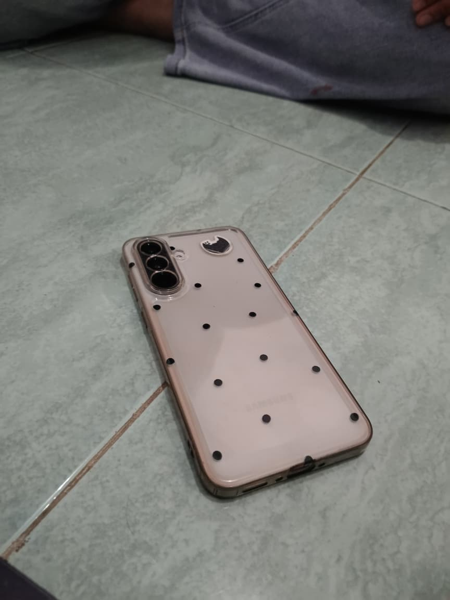
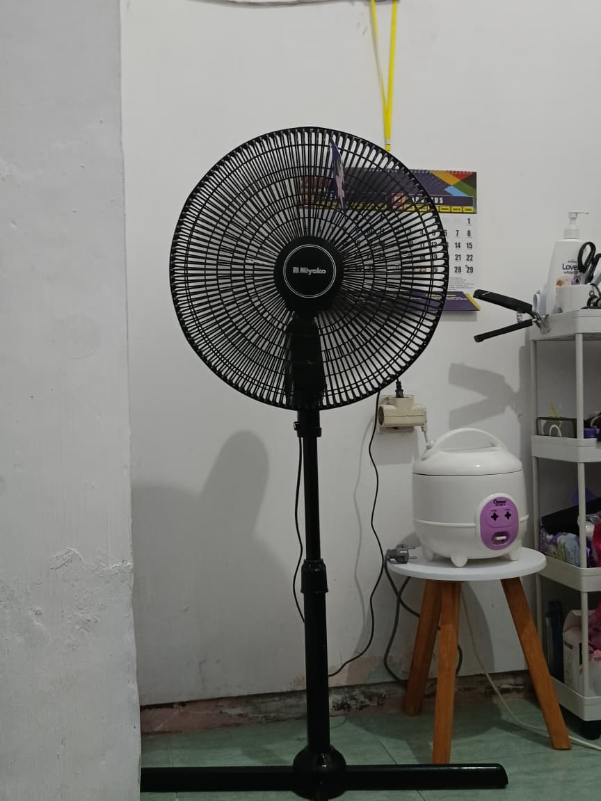

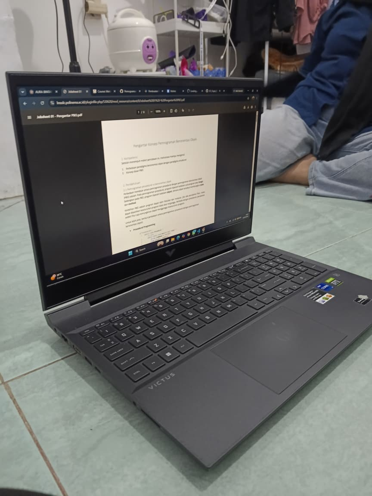

 Input :  
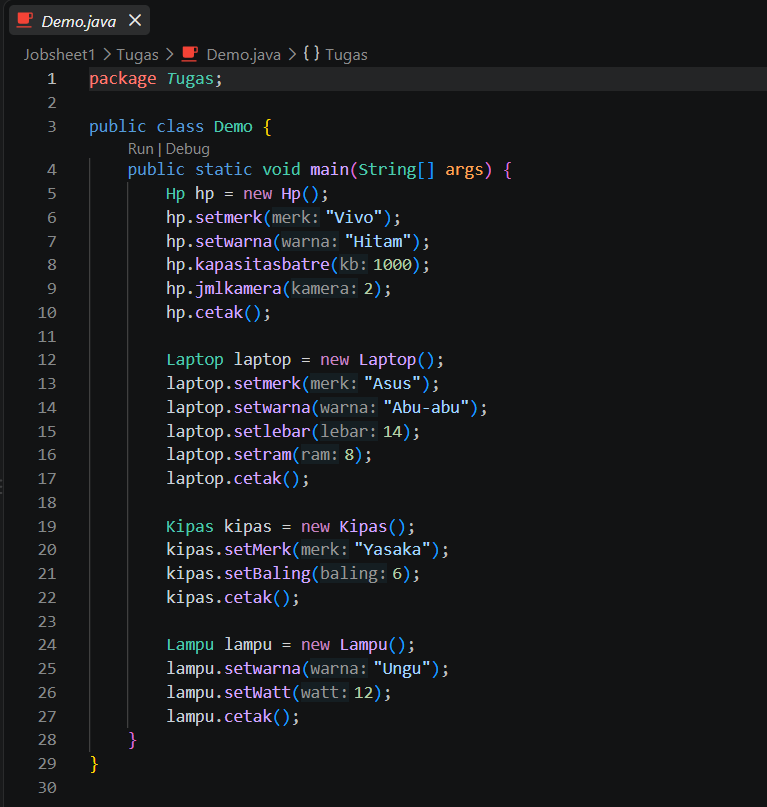
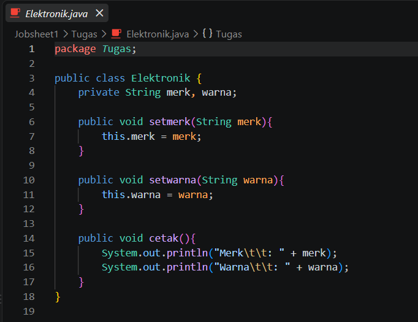
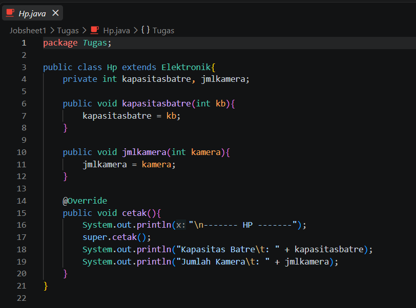
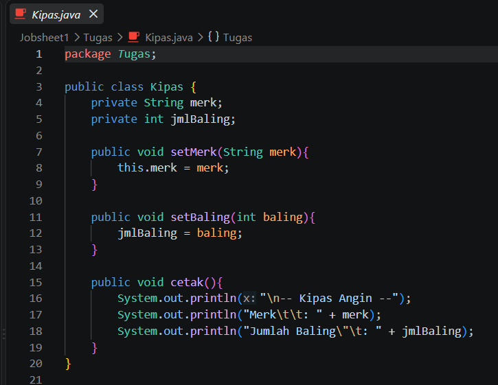
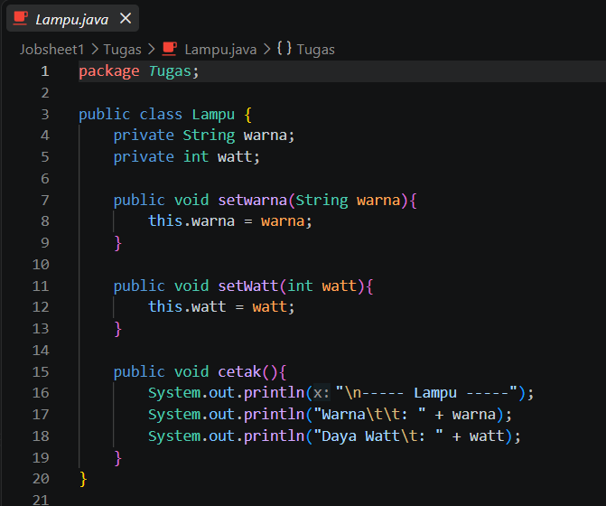
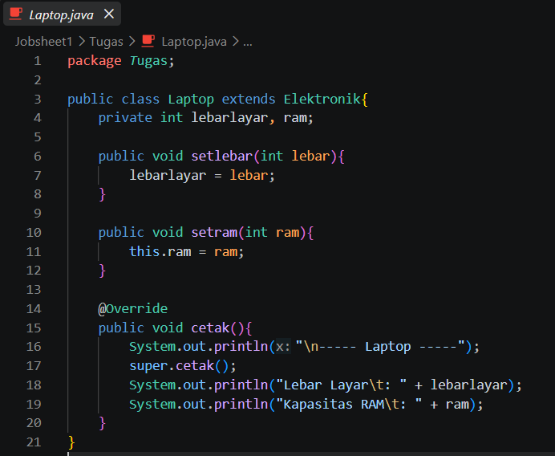

 Output :  
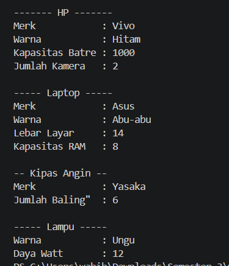