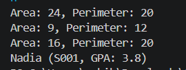

|  | Pemrograman Berbasis Objek |
|--|--|
| NIM |  254107020062|
| Nama | Aura Bintang Aprilian |
| Kelas | TI - 2G |
| Repository | [link] (http://github.com/bebeaura1/PBO/tree/main/Jobsheet2/src/id/ac/polinema) |

# Kelas dan Objek

## Screenshot output program setelah Langkah 7
Untuk hasil running program pada langkah 7 yaitu seperti pada gambar di bawah ini 
