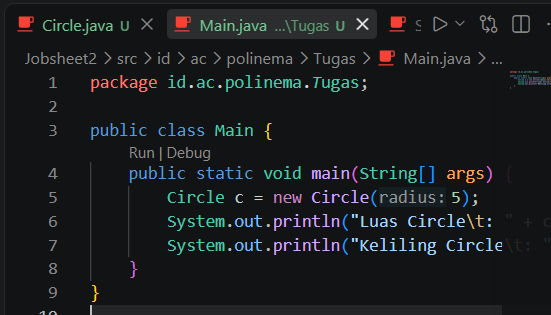
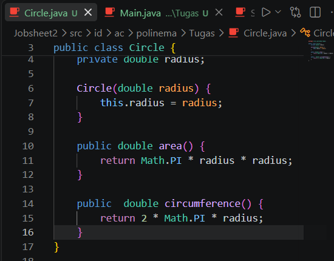
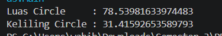

|  | Pemrograman Berbasis Objek |
|--|--|
| NIM |  254107020062|
| Nama | Aura Bintang Aprilian |
| Kelas | TI - 2G |
| Repository | [link] (http://github.com/bebeaura1/PBO/tree/main/Jobsheet2/src/id/ac/polinema) |

# Kelas dan Objek

## Screenshot output program setelah Langkah 7
Untuk hasil running program pada langkah 7 yaitu seperti pada gambar di bawah ini 

## D. Tugas Mandiri

1. Bukti kode 
<b>Input : 
 
  
Output :</b> 
  

2. Jawab singkat (2-3 kalimat masing-masing): 
<b> (a) apa bedanya objek dengan referensi ke objek? 
 -- Jawab : </b>
Objek adalah wujud fisik berupa data dan method yang disimpan di memori. Sememtara referensi ke objek adalah variabel penunjuk yang berisi alamat memori menuju tempat objek tersebut. Mengubah nilai melalui variabel referensi akan langsung memengaruhi objek asli yang ditunjuknya.  
<b>(b) tepatnya kapan konstruktor sebuah kelas dijalankan?
 -- Jawab : </b>
Saat sebuah objek baru dibuat menggunakan kata kunci new. Fungsi utamanya adalah melakukan inisialisasi awal pada nilai nilai atribut kelas begitu objek terbentuk di memori