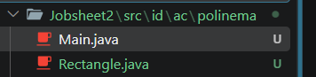
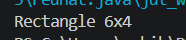
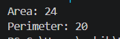
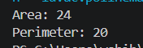
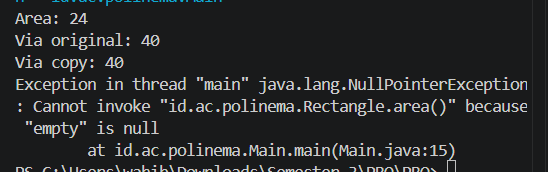
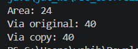
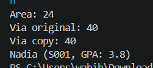

|  | Pemrograman Berbasis Objek |
|--|--|
| NIM |  254107020062|
| Nama | Aura Bintang Aprilian |
| Kelas | TI - 2G |
| Repository | [link] (http://github.com/bebeaura1/PBO/tree/main/Jobsheet2/src/id/ac/polinema) |

# Kelas dan Objek

## Langkah 1 : Buat proyek

## Langkah 2 : Kelas Rectangle minimal dan objek pertama
Untuk hasil running program pada langkah 2 yaitu seperti pada gambar di bawah ini 

## Langkah 3 : Menambahkan method
Untuk hasil running program pada langkah 3 yaitu seperti pada gambar di bawah ini 

## Langkah 4 : Konstruktor dan this
Untuk hasil running program pada langkah 4 yaitu seperti pada gambar di bawah ini 

## Langkah 5 : Referensi, aliasing, dan null
Untuk hasil running program pada langkah 5 yaitu seperti pada gambar di bawah ini 
<b>
- Hasil Null 

- Hasil Benar 

## Langkah 6 : Kelas Student dari diagram UML
Untuk hasil running program pada langkah 6 yaitu seperti pada gambar di bawah ini 

## Langkah 7 : Array of objects
Untuk hasil running program pada langkah 7 yaitu seperti pada gambar di bawah ini 
