|  | Pemrograman Berbasis Objek |
|--|--|
| NIM |  254107020062|
| Nama | Aura Bintang Aprilian |
| Kelas | TI - 2G |
| Repository | [link] (https://github.com/bebeaura1/PBO/tree/main/Jobsheet3) |

# Enkapsulasi Pada Pemrograman Berorientasi Objek

# 3. Percobaan
## 3.1 Percobaan 1 - Enkapsulasi
Untuk hasil running program pada percobaan 1 yaitu seperti pada gambar di bawah ini 
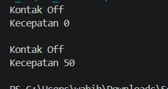 

## 3.2 Percobaan 2 - Access Modifier
Untuk hasil running program pada percobaan 2 yaitu seperti pada gambar di bawah ini 
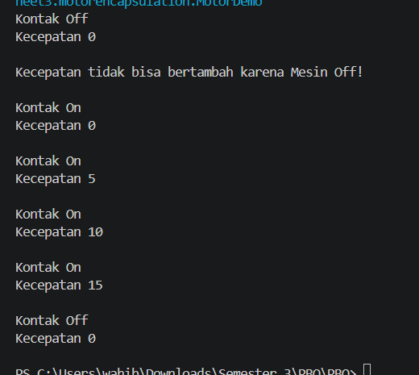 

## 3.3 Pertanyaan
1. Pada class TestMobil, saat kita menambah kecepatan untuk pertama kalinya, mengapa muncul peringatan “Kecepatan tidak bisa bertambah karena Mesin Off!”?
2. Mengapa atribut kecepatan dan kontakOn diset private?
3. Ubah class Motor sehingga kecepatan maksimalnya adalah 100!

**Jawaban pertanyaan**
1. Saat menambah kecepatan untuk pertama kalinya akan muncul peringatan "Kecepatan tidak bisa bertambah karena Mesin Off!" karena mesin baru akan menambah kecepatan saat mesin dalam keadaan menyala. Pada method tambah kecepatan di class Motor, disitu tertulis if kontakOn == true, maka kecepatan baru akan ditambah sebanyak 5. Apabila belum, maka akan muncul peringatan seperti yang tadi disebutkan.
2. Atribut kecepatan dan kontakOn diset private karena untuk melindungi data dari perubahan langsung di luar class Motor. Apabila atribut kecepatan dan kontakOn diset public, data didalam objek kecepatan dan status kontak bisa diakses atau diubah secara sembarangan diluar class Motor.
3. Hasil modifikasi percobaan 2  
-Input :  
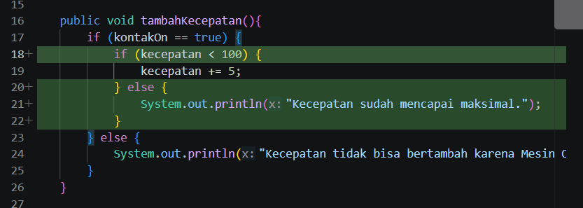 
-Output :  
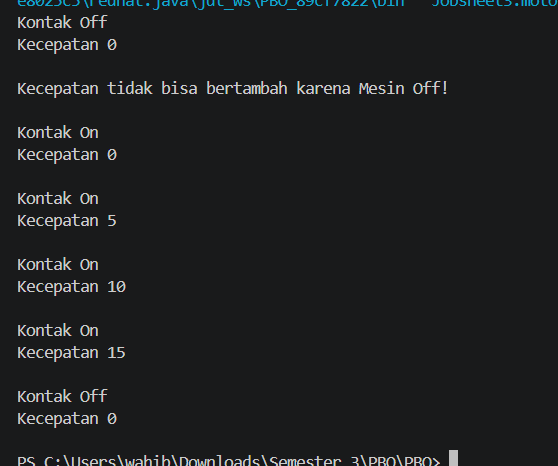 
Misal kecepatan += 50;  
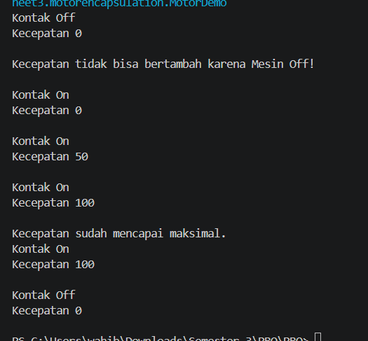 

## 3.4 Percobaan 3 - Getter dan Setter
Untuk hasil running program pada percobaan 2 yaitu seperti pada gambar di bawah ini 
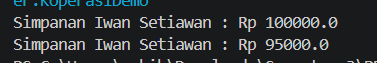 

## 3.5 Percobaan 4 - Konstruktor, Instansiasi
Untuk hasil running program pada percobaan 2 yaitu seperti pada gambar di bawah ini 
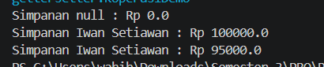 

# 5. Tugas
1. Cobalah program dibawah ini dan tuliskan hasil outputnya
 **Jawab :** 
Input :  
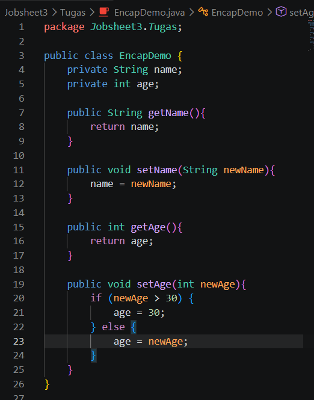 
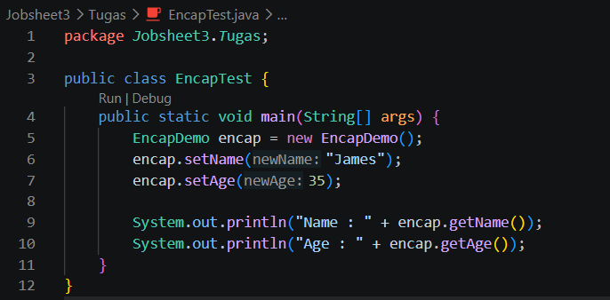 
Output :  
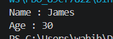  

2. Pada program diatas, pada class EncapTest kita mengeset age dengan nilai 35, namun pada saat ditampilkan ke layar nilainya 30, jelaskan mengapa.
 **Jawab :** 
Hasil umur yang ditampilkan ke layar menjadi 30 padahal waktu menginputkan sebesar 35 adalah karena pada method setAge tertulis apabila newAge itu lebih besar dari 30 maka umurnya akan di set sebesar 30 karna maksimalnya 30. Jadi, karena 35 itu lebih besar dari 30, maka umur 35 akan diset menjadi 30.  

3. Ubah program diatas agar atribut age dapat diberi nilai maksimal
 **Jawab :** 
Input :  
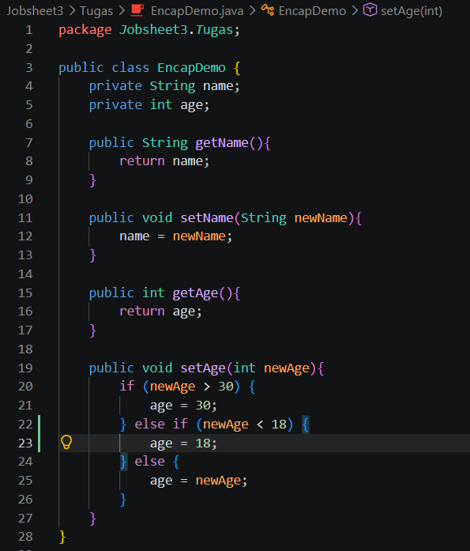 
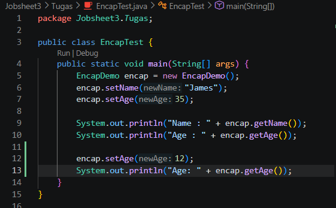 
Output :  
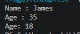  

4. Pada sebuah sistem manajemen pergudangan kargo ekspedisi, terdapat class Kontainer yang memiliki atribut antara lain nomorResi, namaPemilik, kapasitasMaksimal (dalam kg), dan beratMuatanSaatIni. Kontainer dapat menerima tambahan muatan barang dengan batasan kapasitas maksimal yang telah ditentukan. Kontainer juga dapat diturunkan muatannya (bongkar muat). Ketika barang diturunkan, maka jumlah muatan saat ini akan berkurang sesuai dengan nominal berat yang dikeluarkan. Buatlah class Kontainer tersebut, berikan atribut (private), method getter, dan konstruktor sesuai dengan kebutuhan arsitektur enkapsulasi. Uji dengan kelas driver TestLogistik berikut ini untuk memeriksa apakah manajemen state kelas Anda telah berjalan dengan benar:
 **Jawab :** 
Input :  
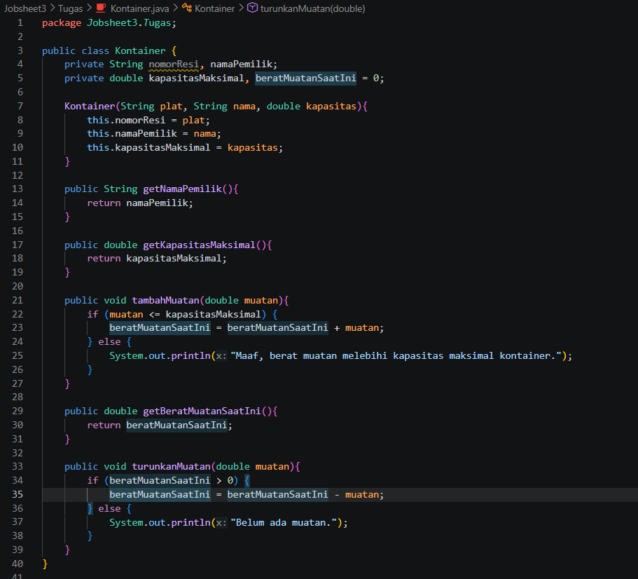 
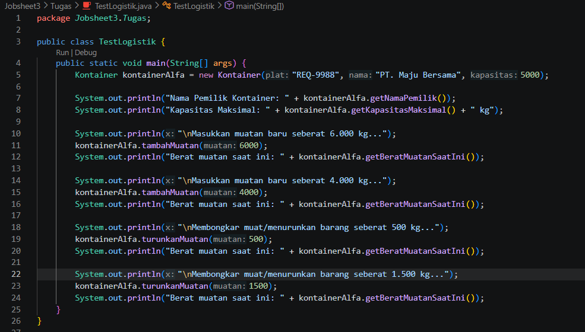 
Output :  
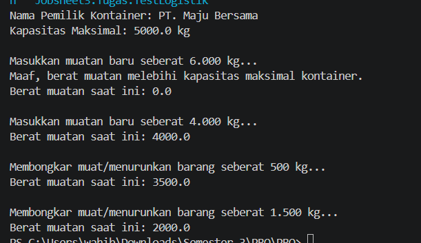  

5. Modifikasi soal kargo logistik di atas agar nominal berat muatan yang dibongkar/diturunkan
dalam satu kali pemanggilan method turunkanMuatan() maksimal hanya boleh sebesar 50%
dari total berat muatan saat ini. Langkah ini diterapkan demi alasan keselamatan kerja
operasional alat berat (crane). Jika operator mencoba menurunkan muatan melebihi batas
50% tersebut, sistem harus memblokir aksi dan memunculkan peringatan: "Maaf, demi
keselamatan, pembongkaran muatan satu kali jalan tidak boleh melebihi 50% dari muatan
saat ini!"
 **Jawab :** 
Input :  
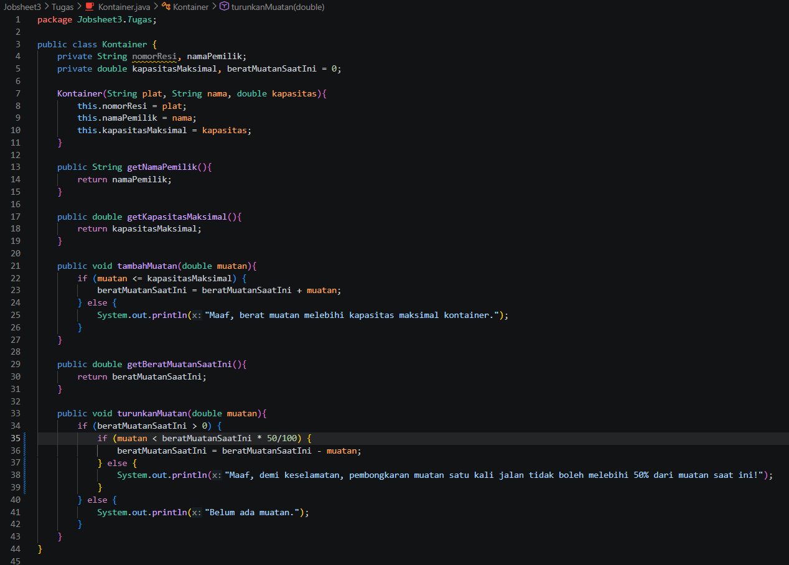 
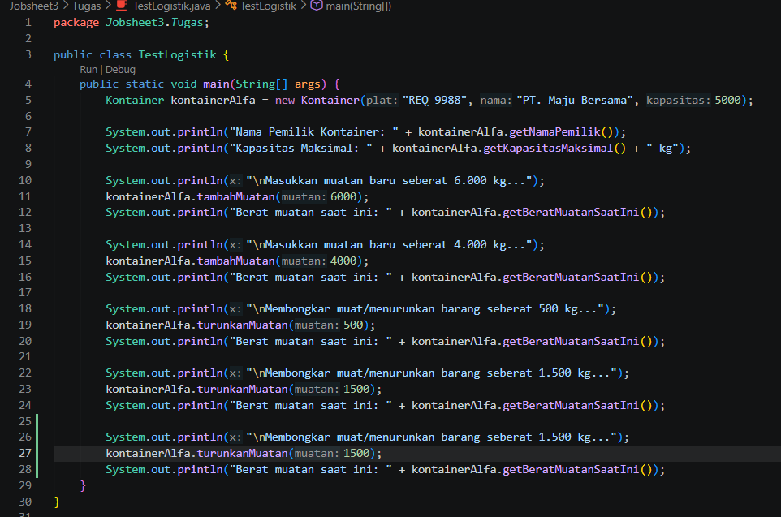 
Output :  
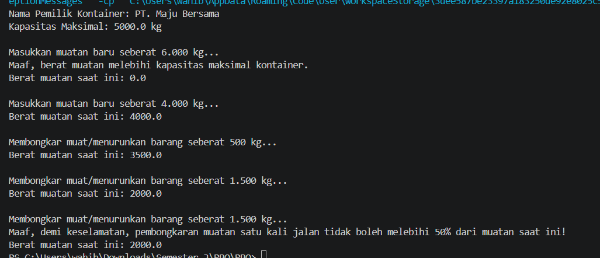  

6. Modifikasi soal kargo logistik di atas agar nominal berat muatan yang dibongkar/diturunkan dalam satu kali pemanggilan method turunkanMuatan() maksimal hanya boleh sebesar 50% dari total berat muatan saat ini. Langkah ini diterapkan demi alasan keselamatan kerja operasional alat berat (crane). Jika operator mencoba menurunkan muatan melebihi batas 50% tersebut, sistem harus memblokir aksi dan memunculkan peringatan: "Maaf, demi keselamatan, pembongkaran muatan satu kali jalan tidak boleh melebihi 50% dari muatan saat ini!"
 **Jawab :** 
Input :  
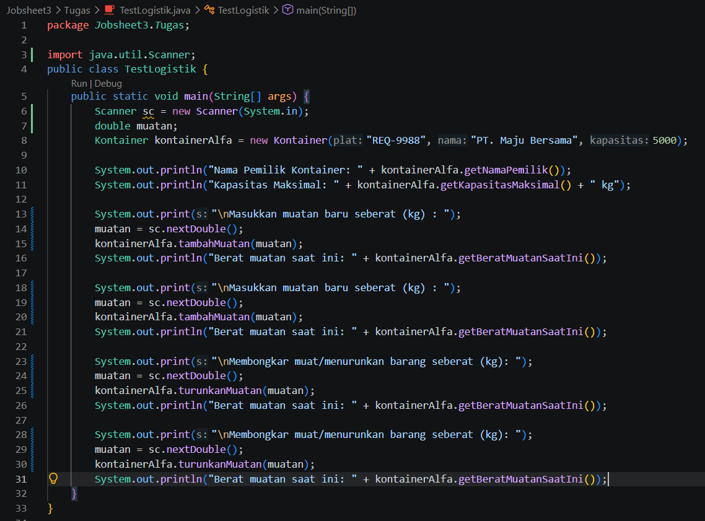 
Output :  
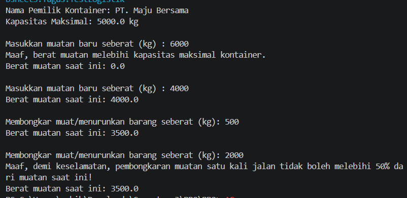  

7. Sebuah aplikasi pemesanan tiket bioskop memerlukan kelas Tiket untuk mengelola data
pemesanan secara aman. Kelas ini harus memiliki atribut private: judulFilm (String),
hargaDasar (double), dan statusPembayaran (boolean).
Ketentuan pengesetan nilai objek:
 ● Konstruktor harus menerima parameter judulFilm dan hargaDasar. Nilai awal
statusPembayaran selalu diset false (Belum Dibayar).
 ● Atribut hargaDasar tidak boleh bernilai negatif. Jika input yang dimasukkan kurang dari 0,
otomatis set nilai default ke Rp 35.000.
 ● Sediakan method lakukanPembayaran() untuk mengubah statusPembayaran menjadi
true.
 ● Nilai statusPembayaran hanya boleh dibaca (Read-Only) menggunakan getter, tidak boleh
memiliki fungsi setter langsung dari luar kelas demi alasan keamanan transaksi.
 ● Uji kode Anda menggunakan kelas TestBioskop berikut:
 **Jawab :** 
Input :  
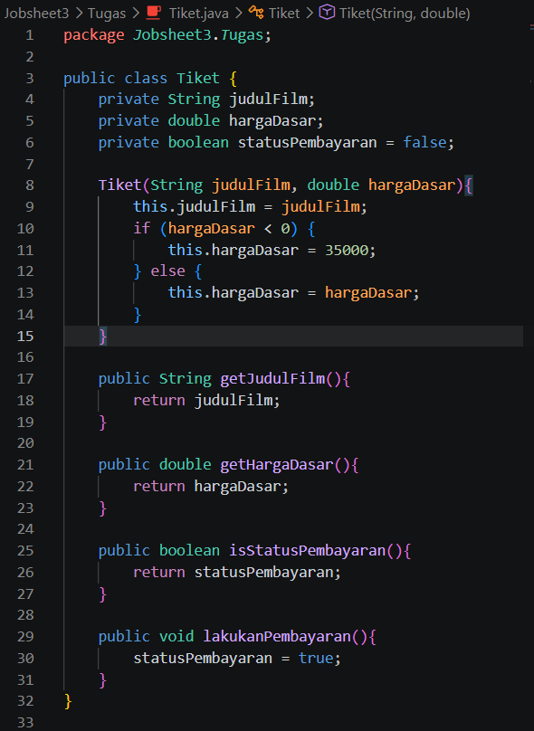 
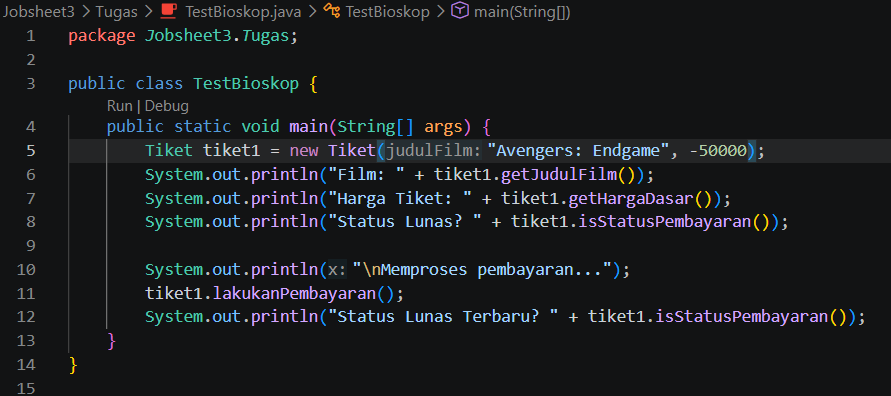 
Output :  
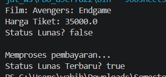  