|  | Pemrograman Berbasis Objek |
|--|--|
| NIM |  254107020062|
| Nama | Aura Bintang Aprilian |
| Kelas | TI - 2G |
| Repository | [link] (https://github.com/bebeaura1/PBO/tree/main/Jobsheet4) |

# Relasi Kelas: Aggregation, Composition, dan Dependency

## - Percobaan 1: Aggregation Satu-ke-Satu (Laptop dan Processor)
Untuk hasil running program pada percobaan 1 pada beberapa langkah yaitu seperti dibawah ini. 
- Langkah 8 : 
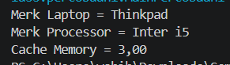 
- Langkah 9 : 
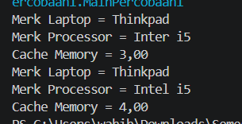 
- Langkah 10 : 
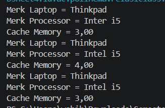 

**Jawaban Pertanyaan Percobaan 1**  
1. Gunanya method setter adalah untuk mengubah dan memberikan set nilai baru ke dalam atribut tersebut. Sedangkan method getter gunanya adalah untuk mengambil nilai dari suatu atribut private. 
2. Konstruktor default digunakan ketika kita ingin membuat objek terlebih dahulu dalam keadaan kosong dimana nilai atributnya baru akan diisi belakangan menggunakan method setter. Sedangkan konstruktor berparameter digunakan ketika kita ingin membuat objek sekaligus langsung memberikan nilai awal pada atribut atributnya dalam satu baris perintah secara instan. 
3. Atribut yang bertipe objek adalah proc. Baris kode yang menunjukkan relasi tersebut adalah baris deklarasi atribut (5) didalam Laptop.java --> private Processor proc; 
4. Sintaks proc.info() berfungsi untuk melakukan delegasi. Kelas Laptop tidak mencetak detail atau informasi tentang processor secara mandiri, tapi menyuruh objek proc dari kelas Processor untuk menjalankan method info() miliknya sendiri. 
5. Tidak, keduanya menghasilkan output yang sama persis. Hal ini karena penentuan jenis relasi tidak bergantung pada dimana objek dibuat. Yang menentukan adalah kelas mana yang memanggil instansiasi new Processor(..). Pada kedua langkah tersebut objek Processor dibuat didalam kelas MainPercobaan1 bukan dibuat didalam kode kelas Laptop itu sendiri. 
6. Secara kode, relasi tersebut termasuk Aggregation. Bukti baris kodenya dapat dilihat pada konstruktor berparameter dikelas Laptop yang menerima objek Processor di luar sebagai parameter serta pada method setternya.  
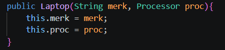 
serta pada method setter 
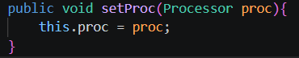 
Objek Processor diciptakan di luar kelas Laptop (oleh MainPercobaan1) lalu di-inject ke dalam Laptop. 
7. Tidak, relasi tersebut berubah menjadi Composition. Alasannya adalah karena objek Processor diciptakan secara mandiri didalam konstruktor kelas Laptop itu sendri menggunakan new Processor ("Generic", 1), bukan diterima sebagai parameter dari luar.Hal ini itu menunjukkan ikatan siklus hidup yang kuat, dimana kalau objek Laptop dihapus, maka objek Processor didalamnya juga akan ikut hilang.  

## - Percobaan 2: Aggregation dengan Relasi Ganda (Rental Mobil)
Untuk hasil running program pada percobaan 2 pada beberapa langkah yaitu seperti dibawah ini. 
- Langkah 6 : 
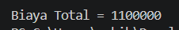 
- Langkah 7 : 
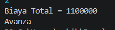 

**Jawaban Pertanyaan Percobaan 2**
1. Baris kode yang menunjukkan relasi tersebut adalah bagian deklarasi atribut di dalam kelas Pelanggan.java  
  
2. Karena kelas Mobil dan Sopir tidak memiliki atribut hari, sehingga mereka tidak mengetahui berapa lama durasi penyewaan tersebut. Nilai hari harus dikirimkan dari luar agar kelas Mobil dan Sopir dapat menghitung total biaya berdasarkan durasi harinya. 
3. Perintah tersebut digunakan untuk melakukan delegasi, di mana kelas Pelanggan tidak menghitung biayanya sendiri, melainkan "menyuruh" objek mobil dan objek sopir untuk menghitung biaya masing-masing berdasarkan jumlah hari sewa. 
4. Sintaks tersebut digunakan untuk melakukan setter injection, yaitu memasukkan atau menghubungkan objek m dan s yang sudah dibuat di luar ke dalam atribut relasi yang ada di dalam objek Pelanggan p 
5. Proses ini digunakan untuk menjumlahkan hasil perhitungan biaya sewa mobil dan biaya sopir selama jangka waktu tertentu, lalu mengembalikan nilai total biaya keseluruhan yang harus dibayar oleh pelanggan. 
6. Urutan eksekusinya adalah method p.getMobil() dieksekusi terlebih dahulu, yang mengembalikan sebuah objek Mobil yang sedang dipegang oleh pelanggan p, kemudian setelah objek Mobil tersebut didapatkan, method .getMerk() dipanggil langsung pada objek Mobil tersebut untuk mengambil dan mengembalikan nilai atribut merek mobil yaitu berupa Sting "Avanza" 
7. Error yang akan muncul adalah NullPointerException. Karena p.setMobil tidak pernah dipanggil, variabel atribut mobil di dalam objek Pelanggan belum pernah diisi dengan objek Mobil yang sah (nilainya masih default yaitu null). Ketika program mencoba menjalankan mobil.hitungBiayaMobil(hari), itu sama saja seperti mencoba mengakses method pada kekosongan alias null, sehingga Java menghentikan program dan memunculkan NullPointerException.  

## - Percobaan 3: Aggregation dengan Dua Role ke Kelas yang Sama (Kereta Api)
Untuk hasil running program pada percobaan 3 pada beberapa langkah yaitu seperti dibawah ini. 
- Langkah 6 : 
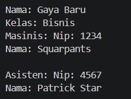 
- Langkah 9 : 
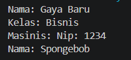 

**Jawaban Pertanyaan Percobaan 3**
1. Baris itu digunakan untuk melakukan delegasi, dimana kelas KeretApi tidak mencetak detail informasi masinis atau asisten secara mandiri, tapi menyuruh masing-masing objek Pegawai untuk menjalankan method info() miliknya sendiri. 
2. Hasil outputnya adalah program berhenti di tengah jalan dan memunculkan error NullPointerException. Hal ini terjadi karena objek KeretaApi dibuat menggunakan konstruktor 3 parameter tanpa menyertakan asisten sehingga atribut this.asisten bernilai null. Ketika method this.asisten.info() dipanggil, program mencoba mengakses method dari sebuah referensi objek yang kosong. 
3. Isi variabel asisten di dalam objek Kereta Api tersebut adalah null, yang berarti variabel referensi tersebut belum diinisialisasi. 
4. Objek masinis tidak perlu dicek dengan cara yang sama. Alasannya karena didalam kedua konstruktor kelas KeretaApi, parameter masinis selalu wajib diisi dan diberikan ke this.masinis. Selain itu, kelas Pegawai tidak memiliki konstruktor default, sehingga objek Pegawai untuk masinis pasti sudah terinisialisasi dengan sah sejak awal dan tidak mungkin bernilai null. 
5. Kereta Api memiliki dua objek Pegawai yang berbeda. Pada kode di langkah 6, instansiasi new Pegawai(...) dipanggil dua kali secara terpisah untuk membuat dua objek yang berbeda, yang satu disimpan ke variabel masinis dan yang satu lagi ke variabel asisten sebelum dikirimkan ke dalam objek KeretaApi.  

## - Percobaan 4: Array of Object dan Multiplicity (Gerbong, Kursi, dan Penumpang)
Untuk hasil running program pada percobaan 4 yaitu seperti dibawah ini. 
- Langkah 6 : 
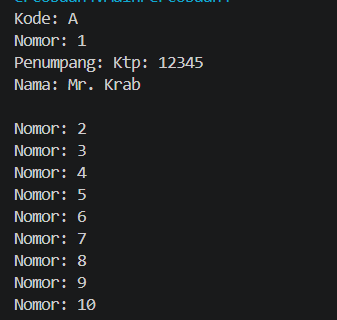 

**Jawaban Pertanyaan Percobaan 4**
1. Jumlah kursi dalam Gerbong A adalah 10 kursi. 
2. Kode itu berfungsi sebagai pengecek untuk memastikan bahwa informasi penumpang hanya akan dicetak apabila kursi tersebut sudah terisi. Jika kursi kosong, program tidak akan mencetak detail penumpang, sehingga terhindar dari error NullPointerException 
3. Nilai nomor dikurangi 1 karena indeks array di Java dimulai dari angka 0, sedangkan nomor kursi yang diinputkan oleh pengguna biasanya dimulai dari angka 1. 
4. Objek penumpang lama (Mr. Krab) pada kursi nomor 1 akan ditimpa dan digantikan oleh objek budi. Java tidak memberikan peringatan ataupun error secara otomatis karena perintah tersebut secara sah melakukan penugasan ulang nilai pada elemen array arrayKursi[0]. 
5. Modifikasi program sehingga tidak diperkenankan menduduki kursi yang sudah ada penumpang lain 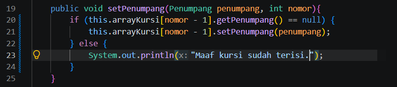 
6. Kita memilih atribut bernama satu-satu jika jumlah objek komponennya sudah pasti, tetap, dan masing-masing memiliki peran atau identitas spesifik yang berbeda. Kita memilih array jika jumlah objek komponennya banyak, dinamis, atau tidak tetap, serta tidak memerlukan nama atribut yang unik satu per satu karena semuanya merepresentasikan entitas yang sejenis 
7. Gerbong-Kursi adalah Composition: Objek Kursi diciptakan sendiri di dalam kelas Gerbong melalui pemanggilan new Kursi(...) di dalam method initKursi() yang dipanggil oleh konstruktor Gerbong. 
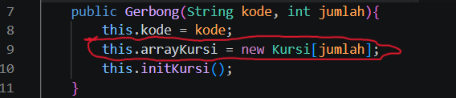 
Kursi-Penumpang adalah Aggregation: Objek Penumpang tidak pernah dibuat di dalam kelas Kursi. Objek tersebut diciptakan di luar (pada MainPercobaan4) lalu dikirimkan (inject) ke dalam objek Kursi melalui method setPenumpang().  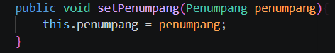
  

## - Percobaan 5: Composition (Mobil dan Mesin)
Untuk hasil running program pada percobaan 5 yaitu seperti dibawah ini. 
- Langkah 5 : 
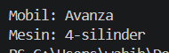 

**Jawaban Pertanyaan Percobaan 5**
1. Baris kode yang menunjukkan hal tersebut adalah pada konstruktor kelas Mobil di mana objek Mesin diinisialisasi secara langsung --> this.mesin = new Mesin(); 
2. Secara desain, penambahan method setter tersebut akan membuka akses dari luar untuk mengganti atau menyisipkan objek Mesin baru. Relasi tersebut tidak akan lagi murni menjadi Composition, tapi bergeser atau melunak menjadi Aggregation, karena objek Mesin kini bisa dikirimkan dan dibuat di luar kelas Mobil 
3. Perbedaannya terletak pada parameter konstruktor dan cara pembuatannya. Pada Percobaan 1 (Laptop), konstruktor menerima objek Processor sebagai marameter yang dibuat diluar. Pada percobaan 5, konstruktor tidak menerima parameter Mesin, tapi langsung memanggil new Mesin() didalam kelasnya sendiri. 
4. Jika objek mobil di-set menjadi null, objek Mesin di dalamnya akan ikut hilang dari memori karena tidak ada referensi lain yang memegangnya. Beda dengan percobaan 1, jika objek Laptop dihapus, objek Processor masih bisa diselamatkan dan tetap hidup karena referensinya juga disimpan didalam variabel terpisah diluar. Mesin tidak bisa diselamatkan karena diciptakan secara eksklusif didalam Mobil tanpa pernah disimpan ke variabel luar. 
5. Relasi tersebut akan berubah menjadi Aggregation. Alasannya karena objek Mesin tidak lagi diciptakan secara eksklusif didalam kelas mobil, tapi dibuat diluar kelas lalu dikirim melalui parameter konstruktor.  
