|  | Pemrograman Berbasis Objek |
|--|--|
| NIM |  254107020062|
| Nama | Aura Bintang Aprilian |
| Kelas | TI - 2G |
| Repository | [link] (https://github.com/bebeaura1/PBO/tree/main/Jobsheet6) |

# Inheritance (Pewarisan)

## - Percobaan 1: Single Inheritance dengan extends (ClassA dan ClassB)
Untuk hasil running program pada percobaan 1 pada beberapa langkah yaitu seperti dibawah ini. 
- Langkah 5 : 
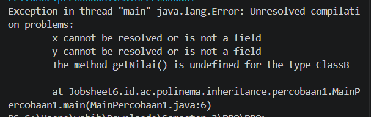 
- Langkah 7 : 
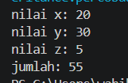 

**Jawaban Pertanyaan Percobaan 1**  
1. Karena pada awalnya ClassB belum diturunkan dari ClassA (extends ClassA belum ditulis), sehingga atribut x dan y tidak dikenal di dalam ClassB 
2. Baris kode yg diubah adalah baris ke 3 diclass ClassB. Deklarasi class diubah menjadi public class ClassB extends ClassA. Artinya, ClassB bertindak sebagai subclass dan ClassA bertindak sebagai superclass, sehingga seluruh atribut/method non-private di ClassA diwarisi oleh ClassB. 
3. Atribut dan method yang dapat dipakai oleh objek hitung: 
    - Dideklarasikan di ClassA: Atribut x, y, dan method getNilai().
    - Dideklarasikan di ClassB: Atribut z, method getNilaiZ(), dan getJumlah(). 
4. Karena ClassB mewarisi atribut x dari ClassA melalui mekanisme pewarisan 
5. Atribut dapat diakses dan diubah secara langsung dari luar class tanpa kontrol validasi 
6. Terjadi error kompilasi karena Java tidak mendukung multiple inheritance. Java hanya mengizinkan satu superclass langsung untuk setiap class 
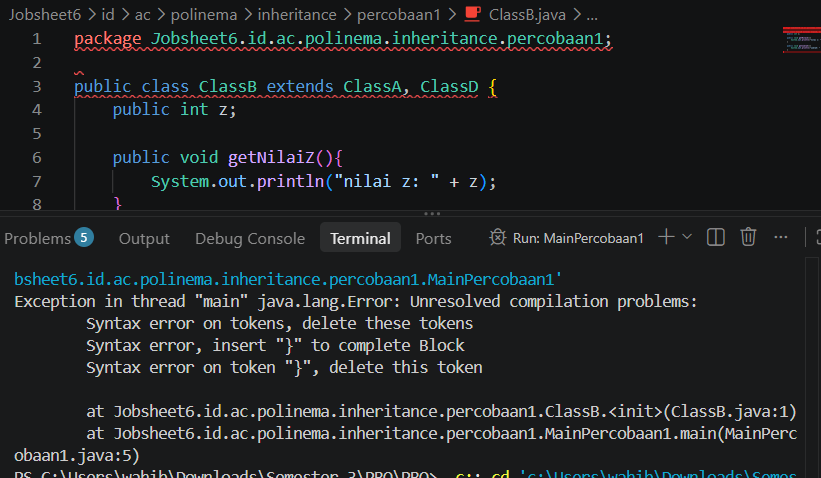 

## - Percobaan 2: Single Inheritance dengan extends (ClassA dan ClassB)
Untuk hasil running program percobaan 2 pada beberapa langkah yaitu seperti dibawah ini. 
- Langkah 5 : 
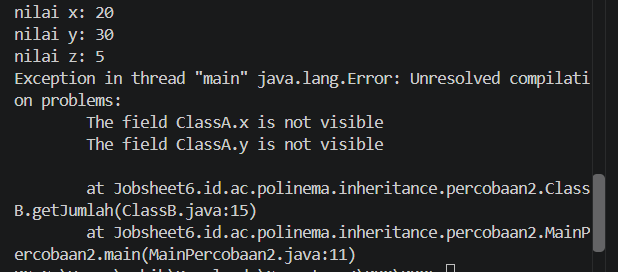 
- Langkah 6 : 
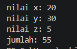 
- Langkah 7 : 
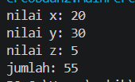 

**Jawaban Pertanyaan Percobaan 2**  
1. Error muncul di file ClassB.java pada baris method getJumlah() dengan pesan : 
 
Error tidak muncul di MainPercobaan2 karena main memanggil method setX() dan setY() yang bersifat public. 

2. Penyebab error: Atribut berhak akses private tidak diwariskan ke subclass, sehingga tidak bisa diakses secara langsung di dalam ClassB 
3. Karena method setX() dideklarasikan sebagai public di dalam ClassA dan diwariskan ke ClassB. Nilai x tersebut disimpan di dalam memori objek ClassB bagian dari ClassA. 
4. Perbaikan B lebih disarankan untuk program nyata karena menerapkan prinsip encapsulation yaitu menyembunyikan data internal class dan mengontrol aksesnya lewat method getter/setter 
5. Atribut protected tetap bisa diakses oleh subclass di package berbeda. Namun, jika atribut berstatus default tanpa modifier, subclass di beda package tidak dapat mengaksesnya. 

## - Percobaan 3: Kata Kunci this dan super (Bangun dan Tabung) 
Untuk hasil running program percobaan 3 pada beberapa langkah yaitu seperti dibawah ini. 
- Langkah 4 : 
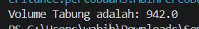 
- Langkah 5 : 
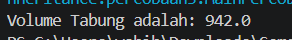 
- Langkah 6 : 
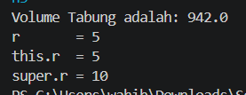 

**Jawaban Pertanyaan Percobaan 3**  
1. Fungsi super pada super.phi = phi; dan super.r = r; adalah digunakan untuk merujuk atau mengakses atribut/method milik superclass, guna membedakannya jika terjadi kesamaan nama variabel. 
2. Fungsi super dan this pada ekspresi super.phi * super.r * super.r * this.t di method volume() adalah kata super pada super.phi dan super.r digunakan untuk mengambil nilai phi dan r dari class Bangun, sedangkan kata this pada this.t digunakan untuk mengambil nilai t milik class Tabung sendiri 
3. Tabung tetap dapat mengakses phi dan r karena diwariskan dari Bangun dan modifiernya protected. Jika diubah menjadi private, maka Tabung kehilangan akses langsung ke atribut tersebut. 
4. Tidak berubah karena jika atribut tidak mengalami shadowing, this.phi akan mencari ke class sendiri, lalu otomatis mencarinya ke superclass jika tidak ditemukan di class sendiri. 
5. r / this.r merujuk pada atribut r milik Tabung, sedangkan super.r merujuk pada atribut r milik Bangun. Awalan super. menjadi wajib itu ketika terjadi shadowing (subclass memiliki variabel dengan nama persis sama dengan superclass). 

## - Percobaan 4: Konstruktor dan Multilevel Inheritance (ClassA, ClassB, ClassC)
Untuk hasil running program percobaan 4 pada beberapa langkah yaitu seperti dibawah ini. 
- Langkah 3 : 
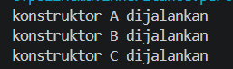 
- Langkah 4 : 
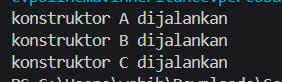 
- Langkah 5 : 
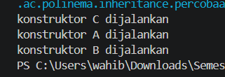 

**Jawaban Pertanyaan Percobaan 4**  
1. ClassA adalah superclass dari ClassB. ClassB adalah subclass dari ClassA sekaligus superclass bagi ClassC. ClassC adalah subclass dari ClassB. ClassB disebut berperan ganda itu karna dia berperan sebagai superclass sekaligus subclass 
2. Hal tersebut terjadi karena saat instisiasi objek subclass (ClassC), Java secara otomatis menjalankan konstruktor dari rantai induknya terlebih dahulu yaitu ClassB. Kemudian saat menjalankan ClassB, java menjalankan induknya dulu yaitu ClassA. Jadi urutannya adalah ClassA -> ClassB -> ClassC 
3. Karena secara default Java otomatis menyisipkan super() di baris pertama konstruktor jika tidak ditulis secara eksplisit. 
4. Melanggar aturan bahwa pemanggilan super(...) harus menjadi baris pertama di dalam konstruktor. Java menetapkan aturan ini agar inisialisasi bagian superclass diselesaikan terlebih dahulu sebelum bagian subclass dieksekusi. 
5. Urutan proses yang terjadi ketika new ClassC() dieksekusi : 
    1. Saat perintah new ClassC() dipanggil, program masuk ke konstruktor ClassC
    2. Sebelum menjalankan kodenya sendiri, konstruktor ClassC secara otomatis memanggil konstruktor dari class induknya (ClassB) menggunakan super()
    3. Begitu juga dengan konstruktor ClassB, sebelum mencetak isinya, konstruktor ini akan memanggil konstruktor class induk di atasnya lagi (ClassA) terlebih dahulu
    4. Proses eksekusi paling awal yang benar-benar mencetak output adalah konstruktor ClassA, sehingga baris "konstruktor A dijalankan" tercetak paling pertama
    5. Setelah konstruktor ClassA selesai, eksekusi turun kembali ke konstruktor ClassB dan mencetak "konstruktor B dijalankan"
    6. Terakhir, setelah konstruktor ClassB selesai, program kembali ke konstruktor ClassC dan mencetak "konstruktor C dijalankan" 

## - Percobaan 5: Konstruktor Berparameter dan Overriding (Komputer, Desktop, Laptop) 
Untuk hasil running program percobaan 5 pada beberapa langkah yaitu seperti dibawah ini. 
- Langkah 4 : 
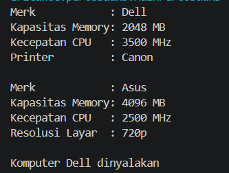 
- Langkah 5 : 
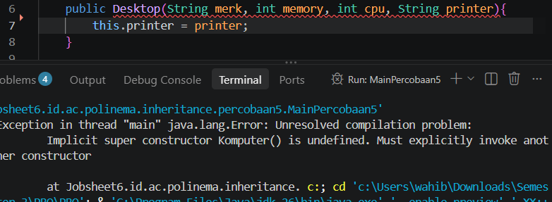 
- Langkah 6 : 
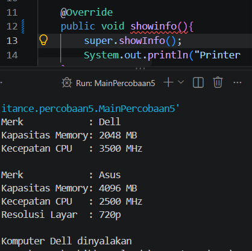
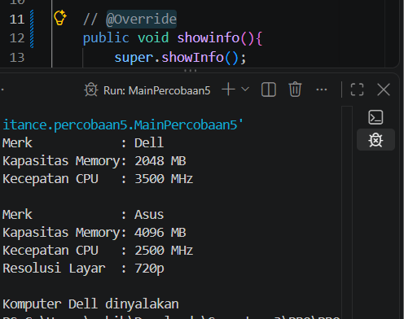 

**Jawaban Pertanyaan Percobaan 4**  
1. Fungsi super(merk, memory, cpu) pada konstruktor Desktop adalah digunakan untuk memanggil konstruktor berparameter yang ada di superclass (Komputer) dan meneruskan nilai2 tersebut ke induknya agar atribut dasar di superclass terinisialisasi dengan benar. Atribut yang diisi oleh baris tersebut adalah merk, kapasitasMemory, dan kecepatanCPU, sedangkan atribut yang diisi oleh baris berikutnya adalah atribut tambahan khusus milik subclass Desktop sendiri, yaitu printer. 
2. Pada Percobaan 4, super() yang tidak ditulis adalah konstruktor default yang otomatis disisipkan oleh compiler. Sedangkan pada Eksperimen 1, error terjadi karena pemanggilan konstruktor berparameter induk tidak sesuai aturan hierarki atau parameter yang dibutuhkan tidak lengkap 
3. Istilah kondisi ini adalah method Overriding. Apabila baris super.showInfo(); pada Desktop dihapus maka informasi dasar dari superclass (seperti Merk, Kapasitas Memory, dan Kecepatan CPU) tidak akan tercetak di layar. Yang tampil di terminal hanya informasi tambahan milik subclass (Printer). 
4. Ketika anotasi @Override dipasang pada method yang salah ketik (misalnya showinfo), compiler Java mendeteksi ketidaksesuaian dan memunculkan garis merah. Namun, jika anotasi @Override dihapus atau tidak digunakan, compiler menganggapnya sebagai method baru yang berdiri sendiri sehingga program tetap bisa di run, tapi fungsi overriding nya gagal bekerja sehingga informasi printer tidak ikut tercetak. Manfaat menuliskan @Override adalah berfungsi sebagai pengaman dari compiler untuk mendeteksi kesalahan penulisan nama method sejak dini. 
5. Ketika objek new Workstation(...) dibuat, konstruktor yang terpanggil dan dieksekusi secara berurutan dimulai dari parent hingga ke child : 
    1. Konstruktor Komputer (menjalankan inisialisasi merk, memory, dan cpu dari class paling atas).
    2. Konstruktor Desktop (menjalankan inisialisasi printer melalui super(...)).
    3. Konstruktor Workstation (menjalankan inisialisasi gpu miliknya sendiri). 
    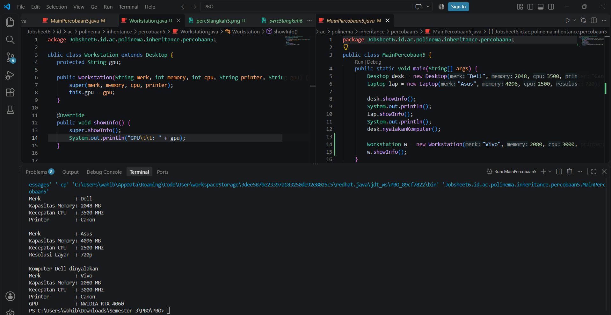 

# D. Tugas dan Deliverable
### Tugas 1: Pegawai, Dosen, dan DaftarGaji
**Input :**
- **Class Dosen** 
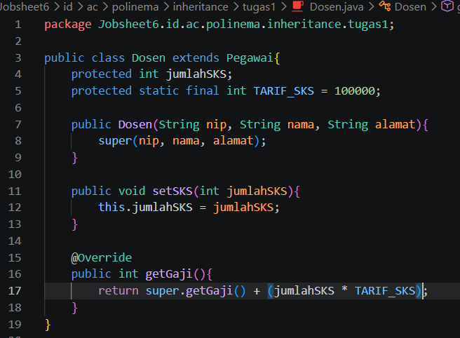 

- **Class DaftarGaji** 
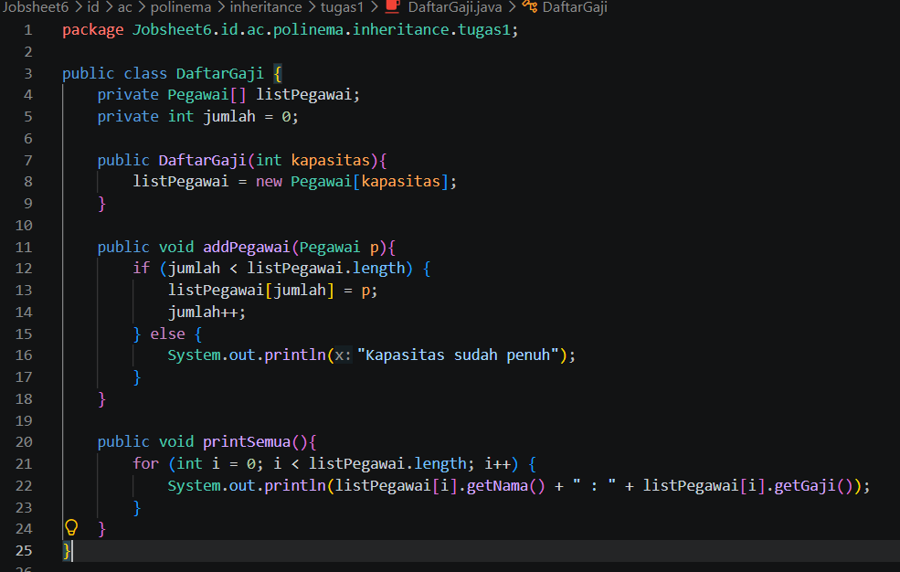 

- **Class Pegawai** 
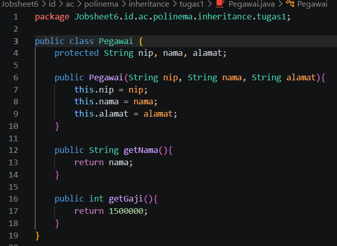 

- **Class MainTugas1** 
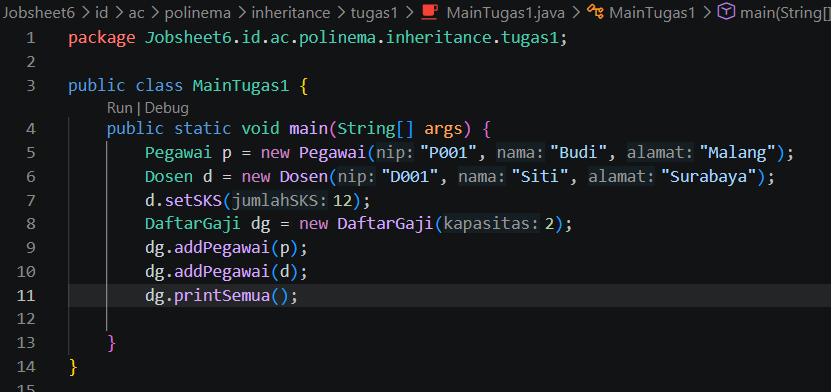 

**Output** 
  

**Jawaban Pertayaan :** 
a) Hal tersebut diperbolehkan karena terdapat hubungan pewarisan dimana kelas Dosen bertindak sebagai subclass dari kelas Pegawai. Dalam konsep PBO, referensi dari tipe superclass dapat digunakan untuk menampung objek dari subclass-nya 
b) Versi method yang dijalankan adalah method getGaji() milik kelas Dosen karena Java mengeksekusi versi method yang sesuai dengan bentuk objek aslinya (Dosen) yang telah melakukan overriding 

### Tugas 2: Televisi dan TelevisiModern 
**Input :**
- **Class Televisi** 
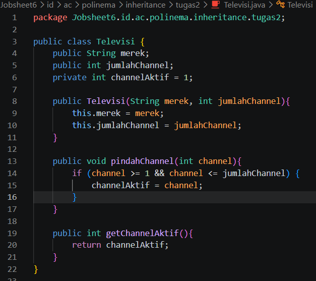 

- **Class TelevisiModern** 
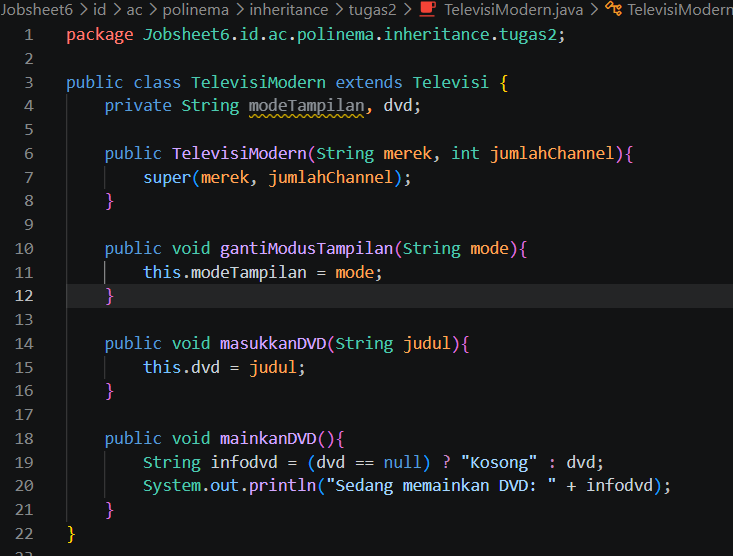 

- **Class MainTugas2** 
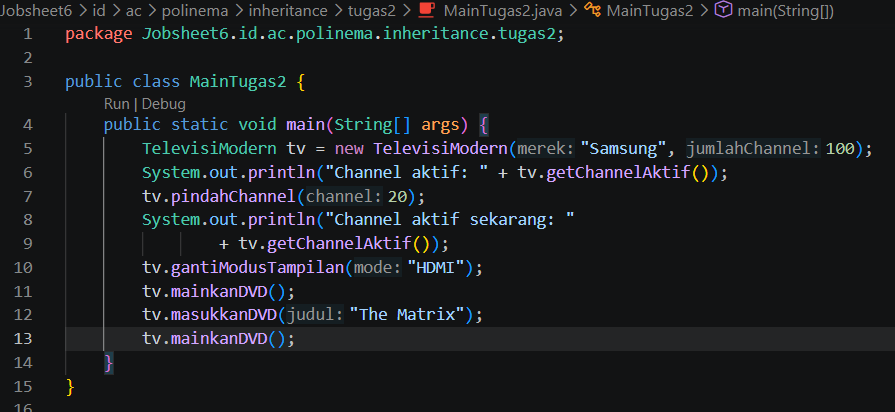 

**Output** 
- **Output awal** 
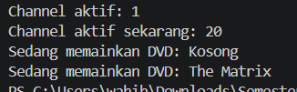  
- **Uji tambahan** 
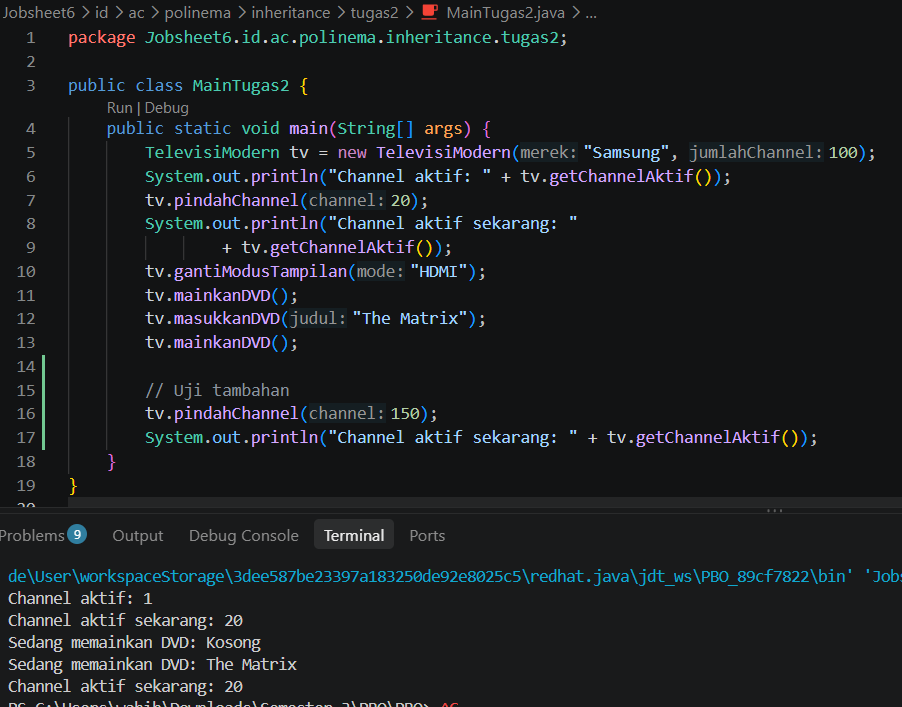 
**Penjelasan :**  
Jika tv.pindahChannel(150) dipanggil, nilai channelAktif akan tetap menjadi 20 karena angka 150 berada di luar rentang jumlahChannel (1-100) sehingga gagal melewati validasi if di dalam method pindahChannel. Selain itu, channelAktif tidak dapat diubah langsung dari MainTugas2 karena variabel tersebut bersifat private, sehingga akses perubahannya harus melalui method khusus yang sudah disediakan oleh kelas induknya.