|  | Pemrograman Berbasis Objek |
|--|--|
| NIM |  254107020062|
| Nama | Aura Bintang Aprilian |
| Kelas | TI - 2G |
| Repository | [link] (https://github.com/bebeaura1/PBO/tree/main/Jobsheet7) |

# Overloading dan Overriding

## - Percobaan 1:  Overloading Method (Perkalian)
Untuk hasil running program pada percobaan 1 pada beberapa langkah yaitu seperti dibawah ini.<br>
- Langkah 3 :<br>
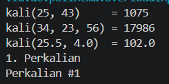<br>
- Langkah 5 :<br>
    - Eror 1<br>
    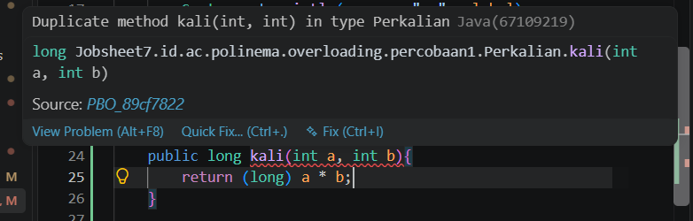<br>
    - Eror 2<br>
    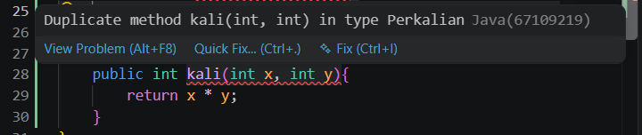<br>
    - Hasil<br>
    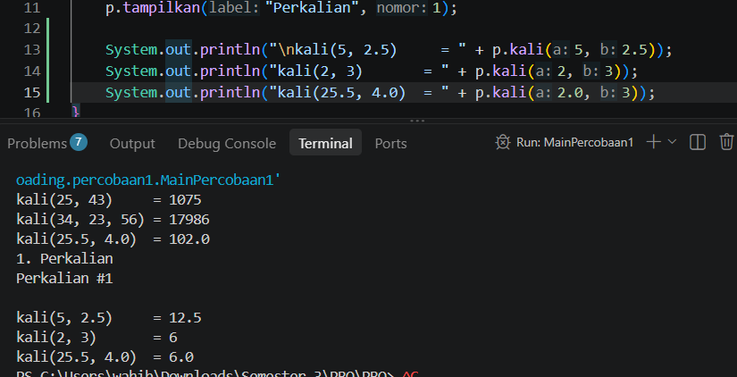<br><br>
        ```
        +----------------------------------------------------------------+
        | Tambahan pada class Perkalian       | Hasil                    |
        |-------------------------------------|--------------------------|
        | public long kali(int a, int b){     | Pesan error : Duplicate  |
        |       return (long) a * b;          | method kali(int, int)    |
        | }                                   | in type Perkalian        |
        |-------------------------------------|--------------------------|
        | public int kali(int x, int y){      | Pesan error : Duplicate  |
        |       return x * y;                 | method kali(int, int)    |
        | }                                   | in type Perkalian        |
        |-------------------------------------|--------------------------|
        | Pada MainPercobaan1:                | Output : 12.5, 6, 6.0    |
        | p.kali(5, 2.5), p.kali(2, 3),       |                          |
        |  p.kali(2.0, 3)                     |                          |
        +----------------------------------------------------------------+
        ```

**Jawaban Pertanyaan Percobaan 1** <br>
1. - Method kali(...) di overload menjadi tiga versi dengan pembeda pada jumlah dan tipe parameter : kali(int, int), kali(int, int, int), dan kali(double, double).
    - Method tampilkan(...) di overload menjadi dua versi dengan pembeda pada urutan tipe parameter : tampilkan(int, String) dan tampilkan(String, int).
2. Versi yang dipanggil adalah kali(double, double). Alasannya karena argumen yang dikirimkan berupa angka desimal (double), sehingga compiler mencocokkan parameter yang tipe datanya sama persis<br>
3. Karena compiler membedakan method berdasarkan jumlah, tipe, dan urutan parameter. Nama variabel parameter dan tipe kembalian tidak ikut dicatat oleh compiler saat melakukan resolusi pemanggilan method.<br>
4. Karena terjadi proses pelebaran tipe data otomatis. Nilai 5 yang bertipe int diperlebar secara otomatis oleh compiler menjadi double agar cocok dengan method kali(double, double)<br>

## - Percobaan 2:  Overloading Method (Perkalian)
Untuk hasil running program pada percobaan 2 pada beberapa langkah yaitu seperti dibawah ini.<br>
- Langkah 2 :<br>
    - Perkiraan
        ```
        +----------------------------------------+
        | Pemanggilan                | Hasil     |
        |----------------------------|-----------|
        | tampil(5)                  | 5         |
        | tampil(5L)                 | 5         |
        | tampil(Integer.valueOf(7)) | 7         |
        | tampil(3.5)                | 3.5       |
        | tampil("Java")             | Java      |
        | tampil()                   | 0         |
        | tampil(1, 2, 3)            | 3         |
        +----------------------------------------+
        ```
    - Hasil<br>
    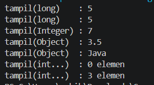<br>
- Langkah 3 :<br>
    ```
        +----------------------------------------------+
        | Kondisi                          | Hasil     |
        |----------------------------------|-----------|
        | Semua overload aktif             | 5         |
        |----------------------------------|-----------|
        | tampil(long) dikomentari         | 5         |
        |----------------------------------|-----------|
        | tampil(long) dan tampil(Integer) | 7         |
        | dikomentari                      |           |
        |----------------------------------|-----------|
        | tampil(long), tampil(Integer),   | 3.5       |
        | dan tampil(Object) dikomentari   |           |
        +----------------------------------------------+
         ```
- Hasil Langkah 3<br>
    - Semua overload aktif :  
    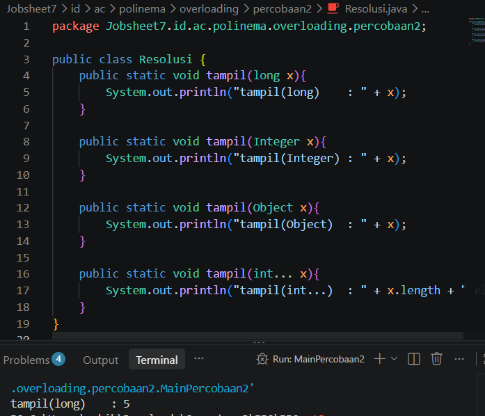<br>
    - tampil(long) dikomentari :  
    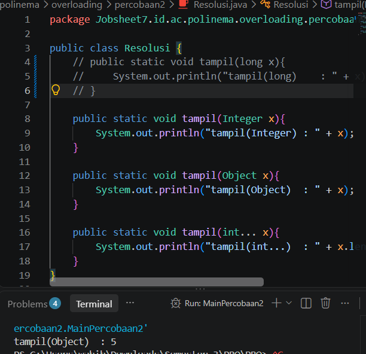<br>
    - tampil(long) dan tampil(Integer) dikomentari  :  
    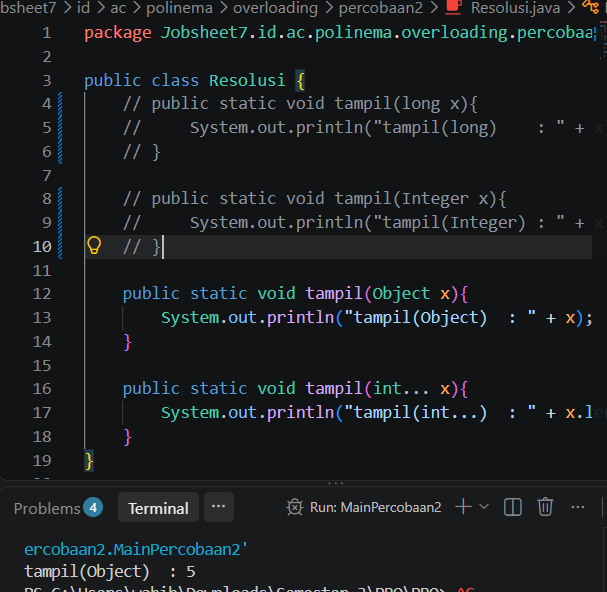<br>
    - tampil(long), tampil(Integer), dan tampil(Object) dikomentari :  
    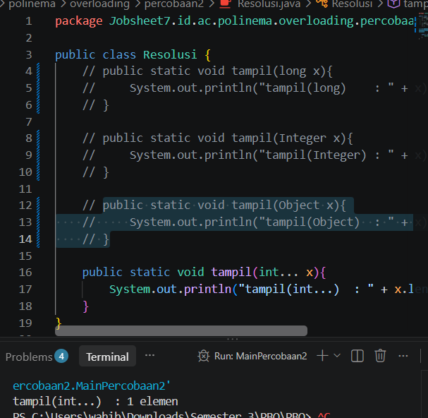<br>
- Langkah 4 :<br>
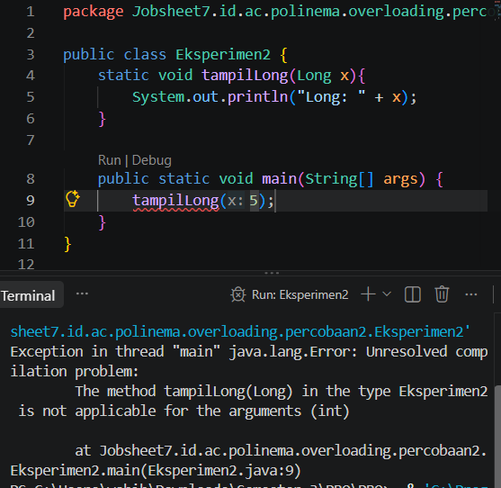<br><br>

**Jawaban Pertanyaan Percobaan 2** <br>
1. tampil(5) memilih tampil(long) karena compiler mengeksekusi Fase 1 terlebih dahulu, yaitu pencocokan eksak dan widening (dari int ke long). Proses boxing (int ke Integer) baru akan dicek pada fase berikutnya jika Fase 1 tidak ada yang cocok<br>
2. Ketika tampil(long) dikomentari, tampil(5) pindah memanggil tampil(Integer) melalui proses boxing. Ketika tampil(Integer) juga dikomentari, ia beralih ke tampil(Object) melalui boxing lalu widening ke Object. Jika ketiganya itu dikomentar, ia akan lari ke tampil(int...)<br>
3. Java tidak mengizinkan kombinasi widening dilanjutkan boxing (dari int ke long lalu ke Long). Sebaliknya, Java mengizinkan boxing dilanjutkan widening dari int ke Integer lalu ke Object<br>
4. Output dari Resolusi.tampil((short) 3) adalah 3 dan Resolusi.tampil('A') adalah angka int yang di widening dari int ke long<br>
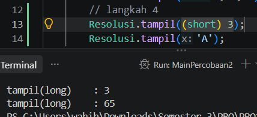<br><br>

## - Percobaan 3:  Overloading Konstruktor (Kucing)
Untuk hasil running program pada percobaan 3 pada beberapa langkah yaitu seperti dibawah ini.<br>
- Langkah 3 :<br>
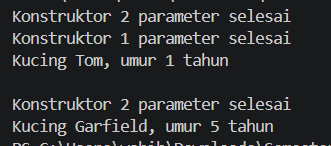<br>